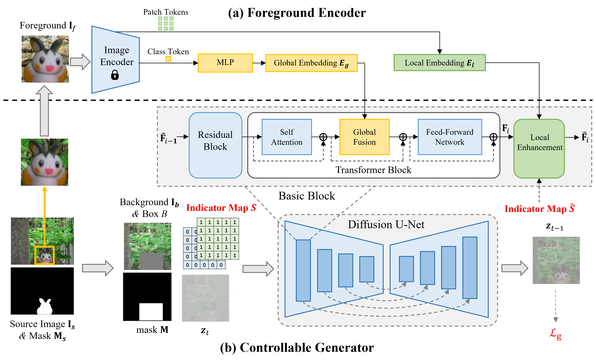

# ControlCom-Image-Composition
## 任务定义


**在我们的可控图像合成模型中，我们使用一个二维二进制指示向量将四个任务统一在一个模型中。其中第一个（或第二个）维度表示是否调整前景光照（或姿态）以与背景兼容。**  1表示进行调整，0表示保持不变。因此，(0,0)对应图像混合，(1,0)对应图像协调，(0,1)对应视角合成，(1,1)对应生成式合成。

<p align='center'>  
  
</p>

我们的方法可以选择性地调整部分前景属性。 **即使前景光照和姿态已经与背景兼容，先前的方法可能会意外甚至不合理地调整前景颜色/姿态。** 在左侧示例中，前景姿态已与背景兼容，但先前的方法进行了不必要的调整。在右侧示例中，前景光照已与背景兼容，但先前的方法以不理想的方式调整了前景颜色。 

<p align='center'>  
  
</p>

**不改变前景姿态的(0,0)、(1,0)版本非常鲁棒且表现良好，但可能会丢失或改变一些微小细节。改变前景姿态的(0,1)、(1,1)版本鲁棒性较差，可能会产生结构扭曲或明显伪影的结果。** 
**请注意，在提供的前景图像中，前景对象的长度和宽度应完全延伸到图像边缘（参见示例），否则性能将受到严重影响。**

## 网络架构

我们的方法基于稳定扩散（stable diffusion），网络架构如下所示。

<p align='center'>  
  
</p>


## 代码与模型

### 1.  依赖

  - Python == 3.8.5
  - Pytorch == 1.10.1
  - Pytorch-lightning == 1.9.0
  - Run

    ```bash
    cd ControlCom-Image-Composition
    pip install -r requirements.txt
    cd src/taming-transformers
    pip install -e .
    ```
### 2.  模型搭建

  - Please download the following files to the ``checkpoints`` folder to create the following file tree:
    ```bash
    checkpoints/
    ├── ControlCom_blend_harm.pth
    ├── ControlCom_view_comp.pth
    └── openai-clip-vit-large-patch14
        ├── config.json
        ├── merges.txt
        ├── preprocessor_config.json
        ├── pytorch_model.bin
        ├── tokenizer_config.json
        ├── tokenizer.json
        └── vocab.json
    ```

### 3. 使用样例合成

  - 使用scripts/inference.py进行图像合成，例如：

    ```
    python scripts/inference.py \
    --task harmonization \
    --outdir results \
    --testdir examples \
    --num_samples 1 \
    --sample_steps 50 \
    --gpu 0
    ```
    or simply run:
    ```
    sh test.sh
    ```


### 4.自定义图像合成

- 请参考examples文件夹准备数据：
  - 每对数据保持相同的文件名。 
  - mask_bbox文件夹或bbox文件夹只需其一即可。 (优先使用mask_box)
  - foreground_mask文件夹是可选的，但推荐使用以获得更好的合成效果。